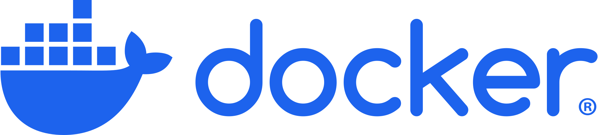

    
    
    

# KuroSearch X Docker

A Project that aims to containerize Kurosearch to jork it in privacy. Self-host it if you want!

## Tag explanation

| Tag            | Description                         |
| :------------- | :---------------------------------- |
| `latest`       | Latest stable release (recommended) |
| `canary`       | Latest development build            |
| `x.y.z[-rc.n]` | Specific release                    |

## Getting Started

Prerequisites:

- [Docker](https://docs.docker.com/get-started/)
- rule34 API credentials

1. Copy [compose.yaml](./compose.yaml) and [.env](./.env.example) to your project folder
2. Edit the .env file. Every variable is required!
3. Run `docker compose up -d`
4. Enjoy!

### Bring your own reverse proxy

> The below instructions only cover the project-specific changes.
> You need to configure your own reverse proxy.

For users who want to plug this container into an existing reverse proxy, do the following:

1. Copy the [Caddyfile](./Caddyfile) to your project folder
   - Replace `{$KUROSEARCH_HOST}` with `:80`
   - Remove the line with `tls`
2. Edit the [compose.yaml](./compose.yaml)
   - set the port mapping to `<your open port>:80`
3. Point your reverse proxy to the port you chose in step 2
4. Run `docker compose up -d`

## Contributing

Pull requests are welcome. For major changes, please open an issue first to discuss what you would like to change.

> ⚠️ Running tests outside the container might fail!
>
> > This is due to the rewrites in the Caddyfile.

Please make sure to update tests as appropriate.

## Got Issues?

Open 'em up in the issues tab (preferably) or contact me. Info below.

Discord: `@flurbudurbur`
